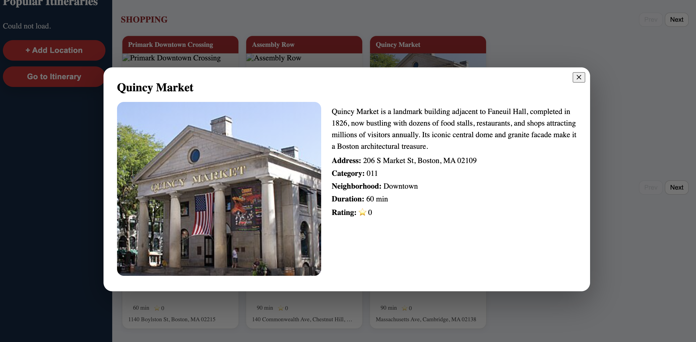
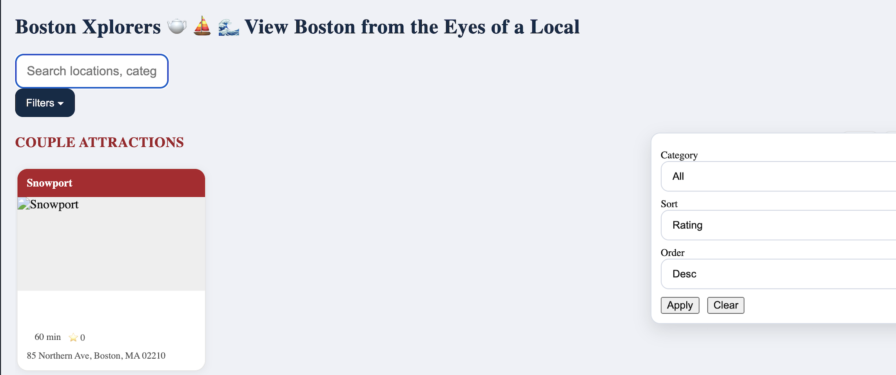
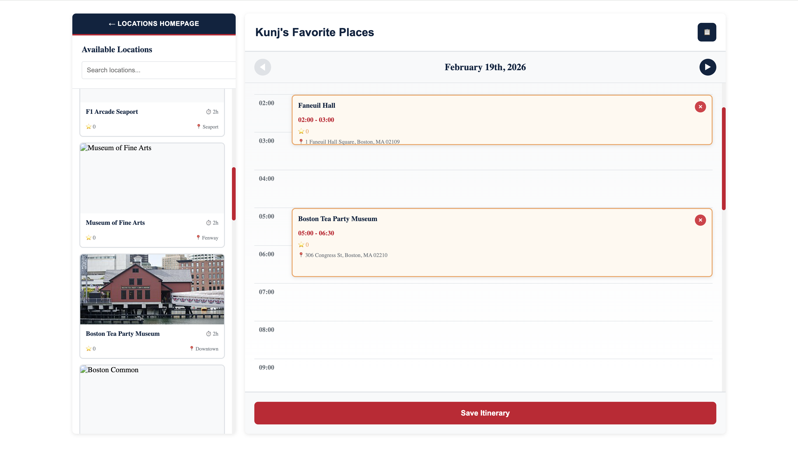

# Project 2:Boston-xplores: View Boston from the eyes of a local

## Author
Kunj Joshi & Nina Jordan

## Class
CS 5600 – Web Design  - Northeastern University
https://johnguerra.co/classes/webDevelopment_online_spring_2026/
---

## Project Objective

Our goal for this project was to design and implement Boston-Xplorers, a web application that enables users to find, organize, and manage locations and itineraries throughout the Boston area. The application provides an inviting platform for exploring Boston as a local, saving destinations, and building personalized travel itineraries through user-focused interface. The project had front-end developed with vanilla HTML5, CSS3, and JavaScript (ES6 modules) alongside a scalable Node.js and Express backend with MongoDB. 

## Features

- Browse and search, Boston locations by category and name
- Filter names and catergories by start rating and the time it takes to complete, assending, desending order
- Create, view, save, and delete personalized itineraries  
- Dynamic location cards with detailed information and modal-based interactions
- Modular front-end architecture implemented with vanilla JavaScript ES6 modules 
- Structured backend following controller, service, route, and validation layers 
- Data using MongoDB Atlas 

---
## Screenshots

### Location Selected

Here From our home page there are multiple rows of catergories with clickable locations. Once clicked - this image displays a location large and in the center of the screen offering clear viewing of location details

### Filter System

Users can use the Search bar to search by catergory or name and the filter drop down to adjust for user rating of that location, or time it takes to complete. 
### Itinerary View

This is our Itinerary main page, were users select locations and add them to their itinerary using a drag and drop and prefilled time slots for easy use.

## Instructions to use and enjoy Boston-Xplorers as a user

The first page you will see is the Homepage, here our locations are displayed by default by catergory name in row format. You can scroll up and down the page viewing locations arraged by catergory. Each catergory Row has a next and prev button inorder to view all locations in that catergory. The search bar allows for users to search for specific locations by name/catergory. It is a live search so options pop up and disapear as users type. The filter toggle has a drop down were you can select a catergorey and filter it by time it takes to complete or user star ratings 0-5, in accending or desending order. Users can use the Add location button on the blue left side bar to add spots around boston they enjoyed that are missing form the app. They can use the prefilled itineraries located on the blueside bar to use others itineraries and save themselves time on researching boston inorder to experince it for themselves. users can use the go to itineray button on the blueside bar to switch to the itinerary main page. From here users have a view of their callender in hour slots and can use the locations on the left hand side and drag and drop location into their itinerary. Itinerarys can be saved and deleted as the user goes.
---
## Instructions to Build and Run Boston-Xplorers Locally

1. Install project dependencies
   npm install

2. Start the development server
   npm run dev

3. Open the application in your browser
   http://localhost:3000

---
## Design Document

The full design document (project description, user personas, user stories, and mockups) is available from:

📄 [View Design Document (PDF)](docs/design-document.md)

---
## Licence 

This project is licensed under the MIT License.

See LICENSE file for details.

