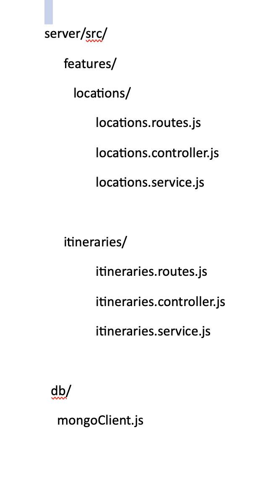
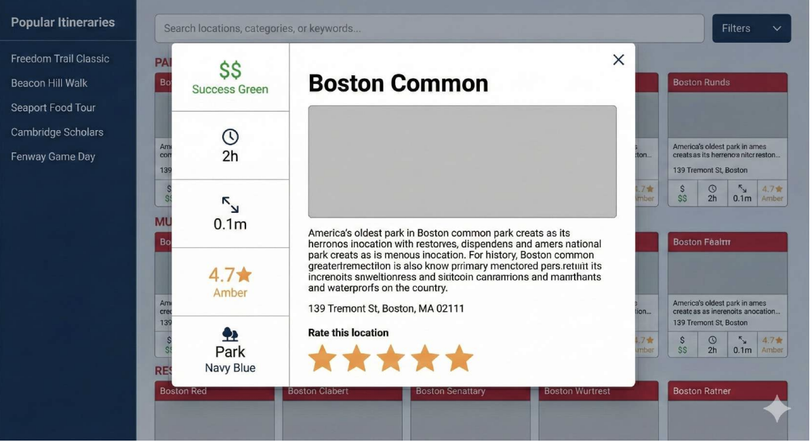
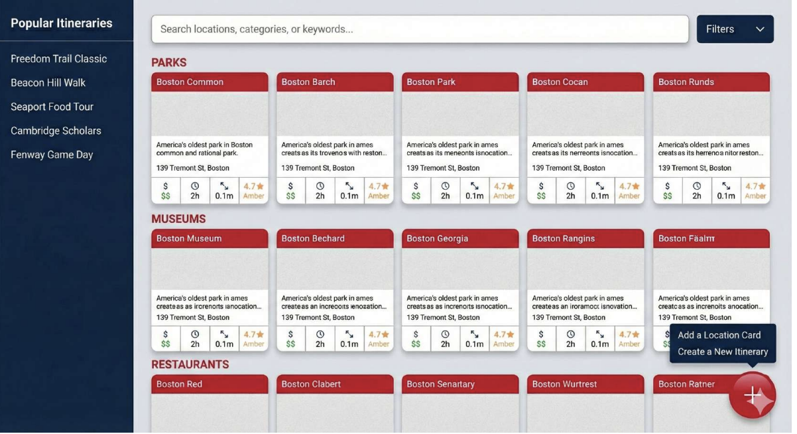
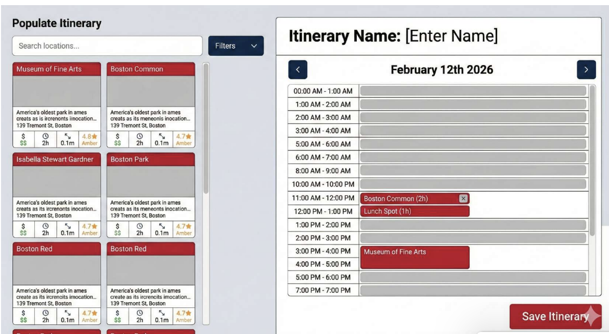

# Design Document – Project 2 - Boston-Xplores

## Project Description

Boston-Xplorers was designed as a centralized destination guide for newcomers and tourists seeking to explore Boston’s attractions in a streamlined and efficient way. The application provides users with the ability to discover notable locations, build personalized itineraries, and browse curated pre-made itineraries without needing to search across multiple platforms or sift through extensive review content.

Users are able to create, save, and manage their own itineraries, as well as copy and customize existing itineraries to suit their preferences. This functionality supports both independent exploration and guided inspiration.

---

## User Personas

### Persona 1 – The Local Bostonian

**Name:** Andrew  

**Wants**
Wants to share the spots he enjoys the most in Boston. Could be pubs, hangout spots, restaurants, picnic spots etc. Also want to share his personal experience at these places and provide images he would have clicked at these places.
 

---

### Persona 2 – Boston Implant

**Name:** Yvette    

**Wants:**
Wants to explore Boston but does not know what places to visit or what are the good spots. Always on lookout for better restaurants, museums, events and different things to do in Boston. Also very time-savvy and wants to plan things on basis of how much time each location takes.

---

### Persona 3 – Boston Tourist with a plan

**Name:** Sonia  

**Wants:**
Wants to create her own itinerary to explore Boston at her own terms and at her own pace. Wants to select places she can visit and create a schedule based on her availability and place's availability matching.

### Persona 4– Boston Tourist with no plan

**Name:** Chris

Wants to explore Boston but does not know what places to visit and does not want to dig into different sites on internet to collect places. Would prefer browsing pre-made itineraries and edit them to his own accord.
---

## User Stories

### Story 1 – For a local

As a user, I am able to to browse different locations in Boston organized by their categories, ratings and expenses.
As a user, I am able to to filter and search for locations based on their categories, ratings, price, distance from public transport, time taken to finish and open timings.
As a user, I enjoy to sort locations on the homepage by their ratings, price and time taken to finish.
As a local Bostonian, I  create more Location cards of hidden gems that I just found in my city and make them more accessible to other people.
As a user, i will rate a location card based on my experience out of 5 Stars.

---

### Story 2 – For a toursit
As a user, i create a personal itinerary with a specified number of days and within a given date range.
As a user, I can to drag and drop a card I just saw to my itinerary.
As a user, I enjoy to copy a pre-made itinerary to my personal itinerary and edit it.
As a user, I love to save my current progress on an itinerary and come to edit it later.
As a user, I want to browse pre-made itineraries on the homepage and filter them on basis of number of days and number of locations covered.

---

## Design Mockups 

### File planing

### Wireframe design planning

